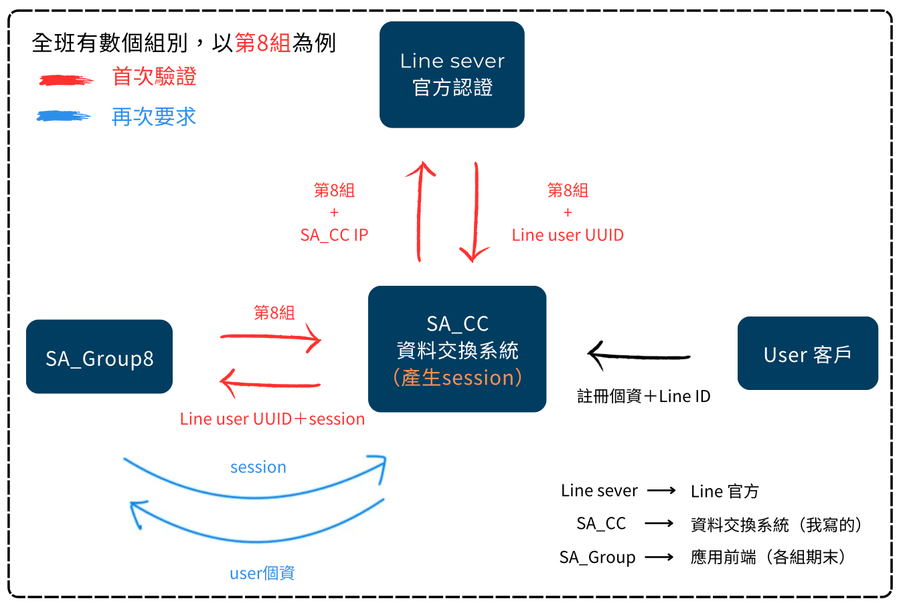

# SA_CC 中心資料交換API伺服器

在系統設計與分析課程期末時，班上各個組別都為減碳商家（[我的組別](https://github.com/hank1224/SA_Group8))，提供不同的服務，因此需要一個資料中心，來讓各個組別存取使用者資料，並達到保護隱私的效果。

在此期間我挺身而出，引領全班設計此系統，並且統一對接標準，讓所有人得以安全存放他們客戶的資料，同時保證隱私。

## 系統架構

<div>
    
    
</div>

## 後台管理介面


## API對接 & 使用說明

### 此為陳澔恩爆肝一個禮拜寫出的系統，瞟竊程式碼前請先摸摸你的良心

如果想不透API為何回傳錯誤，可以到[/apps/RESTapiApp/views.py](SA_ClientCenter/apps/RESTapiApp/views.py) 查詢try catch報錯原理

**首頁：(ngrok地址)/UserInterfaceApp/login_noAccount.html**

**API：(ngrok地址)/RESTapiApp/**

 `/RESTapiApp/Line_1/`
 
 * 用戶傳送:Rbackurl
 
    * 回傳:Rstate

`/RESTapiApp/Line_2/`

 * 用戶傳送:Rstate

    * 回傳:RuserID, Raccess_code

`/RESTapiApp/Access/`

 * 用戶傳送:Raccess_code

    * 回傳：所有個人資料

`/RESTapiApp/SMS_1/`

 * 用戶傳送:Rphone

    * 回傳:RSMSid

`/RESTapiApp/SMS_2/`

 * 用戶傳送:RSMSid, RSMS_code

    * 回傳:RuserID, Raccess_code

**第一次pull請先**
```py
python manage.py makemigrations
python manage.py migrate
#這樣才會建立db檔，然後建立使用者去登入admin
```

1. 有git ignore，但有留migrations資料夾（資料庫模型紀錄檔）跑django不影響，直接runserver就好
2. 如果migrate出錯，migrations 資料夾檔案是可刪的，記得留 init.py 跟 重新建模型 即可，全部app的資料夾都要清空
3. settings 裡面有 LineLogin帳號資訊、內網穿透網址(ngork)、REST驗證Token、台灣簡訊帳號，在裡面修改即可套用到全域設定.

[line-login官方說明](https://developers.line.biz/en/reference/line-login/#response-headers)

[使用轉發：ngrok](https://ngrok.com/)（記得去辦會員就不會過期了）
